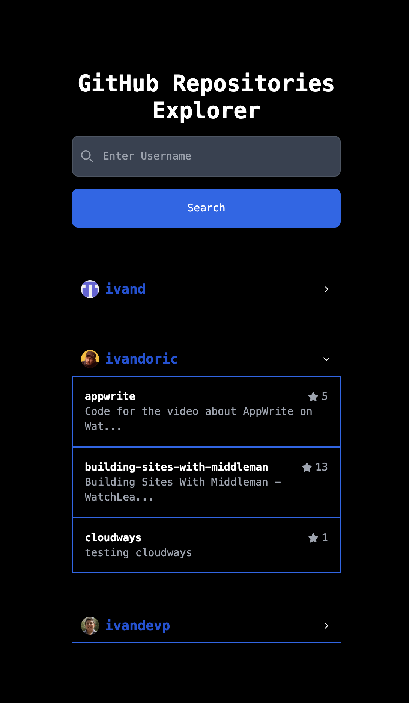

# GitHub Repositories Explorer

## Description
This is Simple GitHub Repositories Explorer. You can search for repositories by name and see the details of the repository.

## Installation
1. Clone the repository  
`git clone https://github.com/ivandi1980/github-repos-explorer.git`
2. Run `npm install` or `yarn install` to install the dependencies
3. Run `npm start` or `yarn start` to start the application
4. Open [http://localhost:3000](http://localhost:3000) to view it in the browser.
5. Enjoy!

## Technologies
- React
- Tailwind CSS
- Axios

## Screenshots

## Author
- [ivandjoh](https://github.com/ivandi1980)
